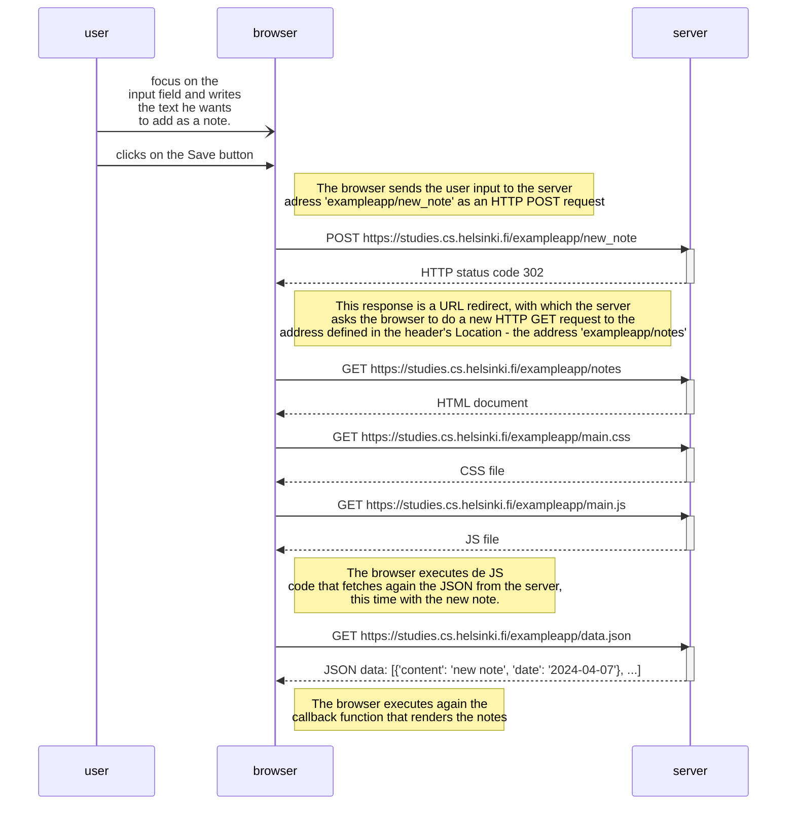

```mermaid
sequenceDiagram 
    participant user
    participant browser
    participant server

    user-)browser: focus on the <br> input field and writes <br> the text he wants <br> to add as a note.
    user->>browser: clicks on the Save button

    Note right of browser: The browser sends the user input to the server <br> adress 'exampleapp/new_note' as an HTTP POST request 

    browser->>server: POST https://studies.cs.helsinki.fi/exampleapp/new_note
    activate server
    server-->>browser: HTTP status code 302
    deactivate server
    Note left of server: This response is a URL redirect, with which the server <br> asks the browser to do a new HTTP GET request to the <br> address defined in the header's Location - the address 'exampleapp/notes'

    browser->>server: GET https://studies.cs.helsinki.fi/exampleapp/notes
    activate server
    server-->>browser: HTML document
    deactivate server

    browser->>server: GET https://studies.cs.helsinki.fi/exampleapp/main.css
    activate server
    server-->>browser: CSS file
    deactivate server

    browser->>server: GET https://studies.cs.helsinki.fi/exampleapp/main.js
    activate server
    server-->>browser: JS file
    deactivate server
    Note right of browser: The browser executes de JS <br> code that fetches again the JSON from the server, <br> this time with the new note.

    browser->>server: GET https://studies.cs.helsinki.fi/exampleapp/data.json
    activate server
    server-->>browser: JSON data: [{'content': 'new note', 'date': '2024-04-07'}, ...]
    deactivate server

    Note right of browser: The browser executes again the  <br> callback function that renders the notes
```

