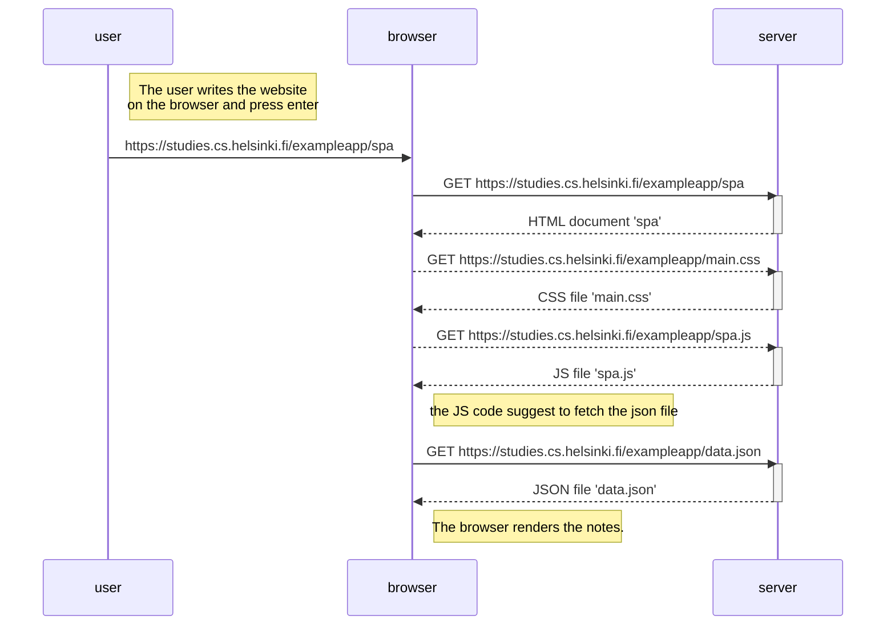

```mermaid
sequenceDiagram
    participant user
    participant browser
    participant server
    
    Note right of user: The user writes the website <br> on the browser and press enter
    user->>browser: https://studies.cs.helsinki.fi/exampleapp/spa

    browser->>server: GET https://studies.cs.helsinki.fi/exampleapp/spa
    activate server
    server-->>browser: HTML document 'spa'
    deactivate server
    browser-->>server: GET https://studies.cs.helsinki.fi/exampleapp/main.css
    activate server
    server-->>browser: CSS file 'main.css'
    deactivate server
    browser-->>server: GET https://studies.cs.helsinki.fi/exampleapp/spa.js
    activate server
    server-->>browser: JS file 'spa.js'
    deactivate server
    
    Note right of browser: the JS code suggest to fetch the json file
    browser->>server: GET https://studies.cs.helsinki.fi/exampleapp/data.json
    activate server
    server-->>browser: JSON file 'data.json'
    deactivate server
    Note right of browser: The browser renders the notes.


```