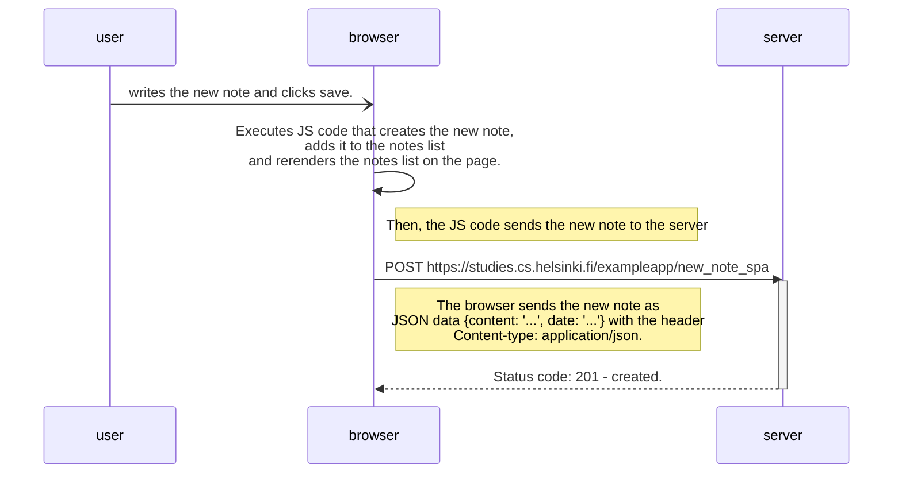

```mermaid
sequenceDiagram
    participant user
    participant browser
    participant server
    
    user-)browser: writes the new note and clicks save.
    
    browser->>browser: Executes JS code that creates the new note, <br> adds it to the notes list <br> and rerenders the notes list on the page. 

    Note right of browser: Then, the JS code sends the new note to the server
    browser->>server: POST https://studies.cs.helsinki.fi/exampleapp/new_note_spa

    activate server
    Note right of browser: The browser sends the new note as <br> JSON data {content: '...', date: '...'} with the header <br> Content-type: application/json.
    server-->>browser: Status code: 201 - created.
    deactivate server
```